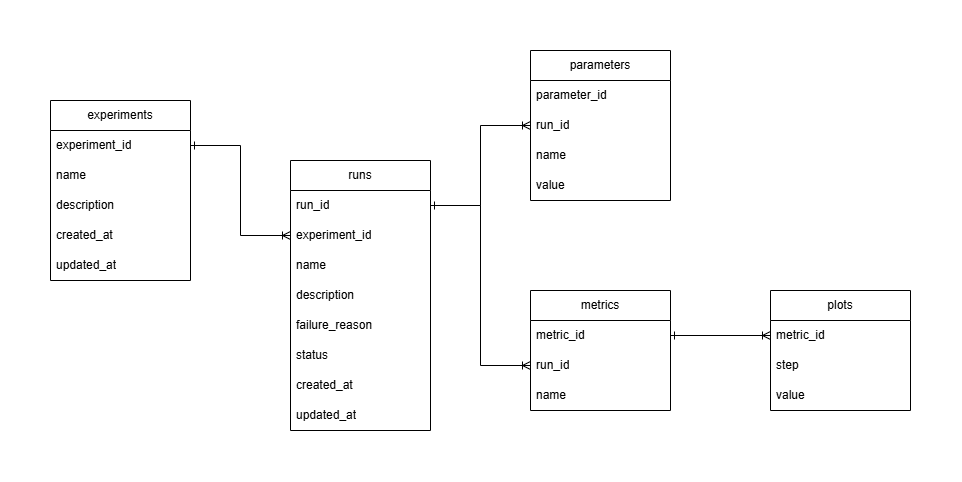

# mlforge

mlforge is a simple metrics tracker for machine learning as a Docker application.  
It records loss trends of machine learning experiments from any train programs you create, via REST API, to MySQL. And you can view the result in this mlforge browser. Of course, you can view comparing other results.  

## Installation

This is the released image:  

- https://hub.docker.com/r/ayatomatsui/mlforge

Only to pull this, it has already done.  

```
docker pull ayatomatsui/mlforge:latest
```


## Usage

as single web application.  

### Environments

Before you build container application, don't forget setting enviroment variables.  
At least, please set them for connecting MySQL host:  

```
DB_HOST
DB_PORT
DB_USER
DB_PASSWORD
DB_NAME
DB_TLS # 0(false) or 1(true)
```

If you set `DB_TLS` true, and the MySQL host published certification, please place the certification `.pem` file in a mlforge container you build, and set the path of `DB_CA_CERT`:  

```
DB_TLS=1
DB_CA_CERT
```

Additionally, in case of mTLS connection, you also transfer certification and set path:  

```
DB_TLS=1
DB_CA_CERT
DB_CLIENT_CERT
DB_CLIENT_KEY
```

### Building and Running

Here, I introduce only a case of local.  
The minimal example is here. But, please configure the appropriate options ased on your environment:  

```
docker build -t mlforge:latest .
docker run mlforge:latest
```

### Checking REST API Specification

After you host mlforge application, you can check REST API specification as Swagger UI, with transfering `/docs` endpoint.  
Any of your batch training applications send requests in this format.  

And you can also get a general idea of the processing flow through the ER diagram:  



### Requiring Step-by-Step

1. Create New Experiment on POST `api/experiments`.
2. Create New Run with Parameters and Metrics on POST `api/experiments/{experimentId}/runs`.
3. Plot steps with value on POST `api/metrics/{metricId}/plots`.
4. Finnaly, you can view the result through mlforge with `/browser` endpoint.
